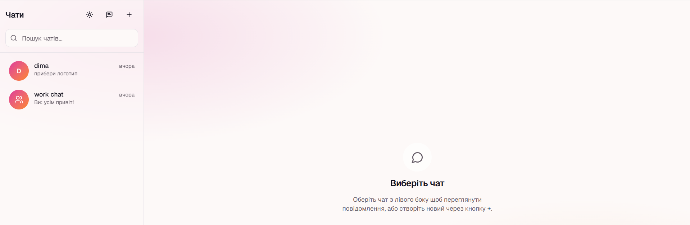
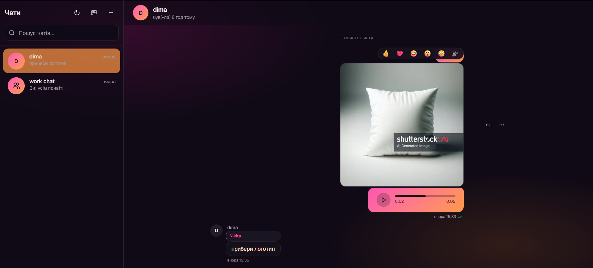
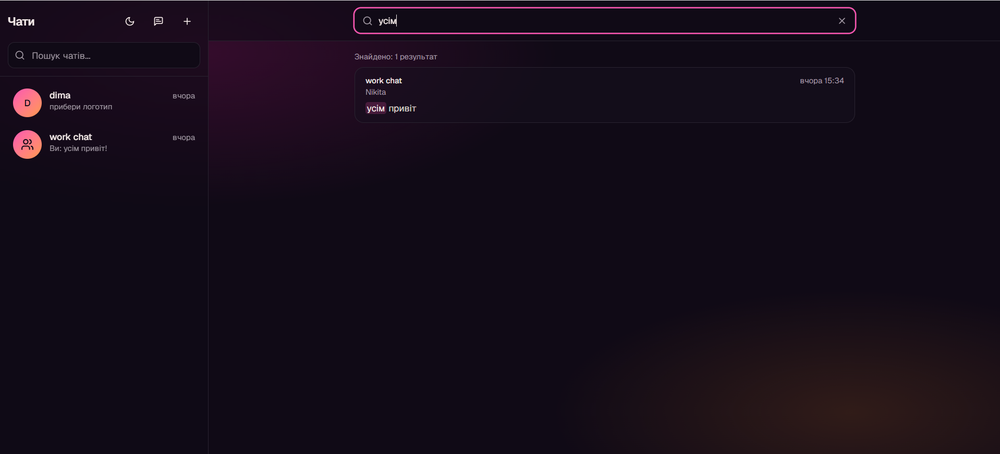

# 💬 chat

> Real-time messaging app — built on a hand-written socket layer, optimistic UI, full-text search, and a delivery pipeline that works on any free tier.

**Live demo:** [chat-xi-eosin-43.vercel.app](https://chat-xi-eosin-43.vercel.app/)

Demo (without registration)
Акаунт 1 / Account 1: nikita@gmail.com / nikita123456
Акаунт 2 / Account 2: dima@gmail.com / dima1234

> 🇬🇧 English below · 🇺🇦 Українська нижче

<!-- TODO: додай 3-4 скріншоти. Рекомендую:
     1. Chat list з sidebar (desktop або mobile drawer)
     2. Message bubble — текст + image attachment + voice message
     3. Search results з підсвіченими matches
     4. Dark mode 
     Поклади їх у docs/ і встав:  -->





---

## 🇬🇧 English

### What it is

A production-grade real-time chat. Two people open a chat in two browsers, one types — the other sees the message appear instantly, with read receipts, typing indicators, presence, file uploads and voice messages. It is built as a portfolio project, but ships with the parts a real product needs: refresh-token rotation, rate limiting, FTS search, optimistic UI with conflict reconciliation, mobile-responsive UI, dark mode, and E2E tests.

The goal was not "another chat clone", but a complete implementation of the patterns that make real-time messaging hard: keeping the UI and the socket layer in sync, doing optimistic writes without duplicating messages, handling reconnects, and surviving the constraints of a free-tier deployment.

### Key features

- **Real-time messaging** — Socket.io broadcast on top of REST writes, with optimistic UI and per-message `clientId` reconciliation (no duplicate when the optimistic message and the broadcast arrive in any order).
- **Direct and group chats** — race-safe DM creation via a denormalised `directKey` UNIQUE constraint, group chats with roles and member management.
- **File attachments** — images with on-the-fly Sharp thumbnails (400×400 webp), documents up to 20 MB, signed URLs with 1-hour TTL. Drag-and-drop drop-zone, inline preview, lightbox.
- **Voice messages** — `MediaRecorder` with multi-codec support (Chrome/Firefox `audio/webm;codecs=opus`, Safari `audio/mp4`), 2-minute cap, inline player with seek, custom controls.
- **Reactions, replies, read receipts** — 6 emoji whitelist, threaded reply previews with scroll-to-parent flash animation, `✓` / `✓✓` for DMs and `seen by N/M` for groups.
- **Full-text search** — Postgres `tsvector` generated column + GIN index + `websearch_to_tsquery`, with `ts_headline` markers rendered as highlighted matches in the UI.
- **Auth** — email verification, password reset, JWT access tokens, refresh-token rotation with httpOnly cookies, argon2id password hashing tuned for production memory/time cost.
- **Mobile-responsive** — sidebar collapses into a drawer below `md`, with hamburger trigger and auto-close on route change.
- **Dark / light / system theme** with `next-themes`, no hydration mismatch.
- **E2E tests** — Playwright covering login flow and real-time message delivery across two browser contexts.

### Architecture decisions worth noting

- **REST writes, sockets only for broadcast.** Sending a message is a normal `POST`, not a socket emit. The server persists the message, then broadcasts it to room members over Socket.io. The sender ignores the broadcast for their own `clientId` because they already inserted the message optimistically. This gives REST-grade error handling, idempotency and observability for writes, while keeping real-time fan-out cheap.
- **Race-safe DM creation via `directKey`.** Two users opening a DM with each other simultaneously would normally race on "does a chat already exist?". Instead of a transaction lock, the schema stores a denormalised `directKey` (sorted user IDs joined with `:`) with a UNIQUE constraint, and DM creation goes through `upsert`. The database resolves the race for us.
- **FTS through a `GENERATED` column Prisma cannot see.** Postgres has a first-class full-text search engine; using anything else would have been ceremony. The `searchVector tsvector` column is `GENERATED ALWAYS` from `content`, indexed with GIN, queried with `websearch_to_tsquery` and rendered with `ts_headline` markers. Prisma 7 doesn't model generated columns, so the column lives only in raw SQL migrations and is queried with `$queryRaw` — a deliberate trade for the best search you can get on Postgres without an external service.
- **Refresh-token rotation, not "just JWT".** Access tokens are short-lived; refresh tokens are opaque random strings stored as SHA-256 hashes, rotated on every refresh, kept in httpOnly cookies. Stolen refresh tokens are detected and invalidate the entire session family. This is what "real" session security looks like — not a 30-day JWT in localStorage.
- **One S3 abstraction, two backends.** Dev runs MinIO in Docker (fast, free, no internet). Prod runs Cloudflare R2 (zero egress fees, S3-compatible). Both speak the same SDK behind one upload service; switching backends is one env var.
- **Optimistic UI with proper rollback.** Every send inserts a placeholder with `status: "sending"`. On success, the server's message replaces it (matched by `clientId`). On failure, the placeholder is removed and the input restored — so a network blip never silently eats a message.
- **Production deploy on three free tiers.** Vercel (frontend) + Render free (backend) + Neon (Postgres) + Upstash (Redis) + Cloudflare R2 (files) + Resend (email). Total cost: \$0/mo. The architecture explicitly works around free-tier constraints: Render sleeps after 15 min idle, so the client tolerates cold starts; Resend HTTP API is used instead of SMTP because Render blocks outbound SMTP ports.

### Tech stack

- **Frontend:** Next.js 16 (App Router, Turbopack), React 19, Tailwind v4, shadcn/ui, TanStack Query, Framer Motion
- **Backend:** Node.js + Express 5, TypeScript, Socket.io, Prisma 7, Zod
- **Database:** PostgreSQL (Neon in production), Redis (Upstash, Socket.io adapter)
- **Files:** MinIO (dev) / Cloudflare R2 (prod), Sharp for thumbnails
- **Auth:** `jose` (JWT), `argon2` (passwords), HTTP-only cookies
- **Email:** Resend HTTP API
- **Tests:** Vitest + supertest (integration, real Postgres), Playwright (E2E)
- **Hosting:** Vercel + Render + Neon + Upstash + Cloudflare R2

### Project structure

```
chat/
├── client/     # Next.js frontend
├── server/     # Express + Socket.io backend
└── shared/    # DTOs and socket event types (Zod schemas)
```

The monorepo is wired with `npm` workspaces. `shared/` compiles to `dist/` and is consumed by both client and server through a path alias — single source of truth for DTOs, with full type safety across the network boundary.

### Running locally

```bash
# 1. Install dependencies in all three workspaces
npm install
cd shared && npm run build && cd ..

# 2. Start infra (Postgres + Redis + MinIO + Mailpit)
docker compose up -d

# 3. Configure .env in server/ and client/ (see .env.example)

# 4. Apply migrations
cd server && npx prisma migrate deploy

# 5. Run both apps (in separate terminals)
cd server && npm run dev      # http://localhost:5000
cd client && npm run dev      # http://localhost:3000
```

### Running tests

```bash
# Integration tests (server) — real Postgres on docker-compose.test.yml
cd server
docker compose -f ../docker-compose.test.yml up -d
npm test

# E2E tests (Playwright) — needs dev servers running
cd client
npm run seed:e2e   # in server/, creates alice@e2e.test + bob@e2e.test
npm run test:e2e
```

---

## 🇺🇦 Українська

### Що це

Production-grade чат у реальному часі. Двоє відкривають чат у двох браузерах, один пише — інший миттєво бачить повідомлення з read receipts, typing indicators, presence, файлами та голосовими. Це портфоліо-проект, але з усім, що потрібно реальному продукту: ротація refresh-токенів, rate limiting, FTS пошук, optimistic UI з reconciliation, mobile-responsive верстка, dark mode та E2E-тести.

Мета — не «ще один клон Telegram», а повна реалізація патернів, що роблять realtime-чат непростим: тримати UI та socket-шар синхронно, робити optimistic writes без дублювання повідомлень, обробляти reconnect-и та вижити в обмеженнях free-tier-ів.

### Ключові можливості

- **Realtime-обмін** — Socket.io broadcast поверх REST-write-ів, optimistic UI з reconciliation за `clientId` (без дублювання коли optimistic і broadcast приходять у будь-якому порядку).
- **Приватні та групові чати** — race-safe створення DM через денормалізований UNIQUE `directKey`, групові чати з ролями та керуванням учасниками.
- **Вкладення** — зображення з on-the-fly Sharp thumbnails (400×400 webp), документи до 20 МБ, signed URL-и з TTL 1 година. Drag-and-drop drop-zone, inline preview, lightbox.
- **Голосові повідомлення** — `MediaRecorder` з multi-codec (Chrome/Firefox `audio/webm;codecs=opus`, Safari `audio/mp4`), ліміт 2 хв, inline-плеєр із seek та власними контролами.
- **Реакції, відповіді, read receipts** — whitelist із 6 емодзі, threaded reply preview зі scroll-to-parent flash-анімацією, `✓` / `✓✓` для DM і `seen by N/M` для груп.
- **Full-text пошук** — Postgres `tsvector` generated column + GIN index + `websearch_to_tsquery`, з маркерами `ts_headline`, що рендеряться як підсвічені matches.
- **Auth** — підтвердження email, скидання паролю, JWT access токени, ротація refresh-токенів у httpOnly cookies, argon2id з prod-tuned memory/time cost.
- **Mobile-responsive** — sidebar згортається в drawer нижче `md`, hamburger trigger, авто-закриття на зміну route.
- **Dark / light / system тема** через `next-themes`, без hydration mismatch.
- **E2E-тести** — Playwright покриває login flow та realtime-доставку між двома browser-context-ами.

### Архітектурні рішення, варті уваги

- **REST для write-ів, sockets лише для broadcast.** Відправка повідомлення — звичайний `POST`, не socket emit. Сервер зберігає повідомлення, потім бродкастить членам кімнати через Socket.io. Sender ігнорує свій же broadcast за `clientId` бо вже вставив повідомлення optimistic-но. Це дає REST-grade error handling, idempotency та observability для write-ів, при цьому realtime fan-out лишається дешевим.
- **Race-safe створення DM через `directKey`.** Двоє юзерів, що одночасно відкривають DM один з одним, нормально racили б на "чи існує вже чат?". Замість transaction-lock у схемі лежить денормалізований `directKey` (відсортовані userId-и через `:`) з UNIQUE constraint, створення DM іде через `upsert`. Race вирішує сама БД.
- **FTS через `GENERATED` колонку, яку Prisma не бачить.** У Postgres є first-class FTS-движок; використовувати щось інше було б ceremony. Колонка `searchVector tsvector` — `GENERATED ALWAYS` із `content`, з GIN-індексом, query через `websearch_to_tsquery`, рендер через `ts_headline`-маркери. Prisma 7 не моделює generated-колонки, тому колонка живе тільки в raw SQL-міграціях і queryється через `$queryRaw` — свідомий trade-off за найкращий пошук, що можна отримати на Postgres без зовнішнього сервісу.
- **Ротація refresh-токенів, а не "просто JWT".** Access-токени короткоживучі; refresh-токени — opaque random strings, що зберігаються як SHA-256 хеші, ротуються при кожному refresh, лежать у httpOnly cookies. Викрадені refresh-токени детектуються та інвалідують усю session family. Це те, як виглядає "справжня" session security — а не 30-денний JWT у localStorage.
- **Один S3-абстракції, два бекенди.** Dev крутить MinIO у Docker (швидко, безкоштовно, без інтернету). Prod — Cloudflare R2 (нуль egress fees, S3-сумісний). Обидва говорять одним SDK за upload-сервісом; перемикання — одна env-змінна.
- **Optimistic UI з правильним rollback.** Кожен send вставляє placeholder зі `status: "sending"`. На success — серверне повідомлення замінює його (matched за `clientId`). На failure — placeholder видаляється, input відновлюється — щоб network-blip ніколи мовчки не "з'їв" повідомлення.
- **Production-деплой на трьох free-tier-ах.** Vercel (фронт) + Render free (бек) + Neon (Postgres) + Upstash (Redis) + Cloudflare R2 (файли) + Resend (email). Загальна вартість: \$0/міс. Архітектура свідомо обходить обмеження free-tier-ів: Render засинає після 15 хв простою, тому клієнт толерує cold-start-и; Resend HTTP API використано замість SMTP, бо Render блокує outbound SMTP-порти.

### Технічний стек

- **Frontend:** Next.js 16 (App Router, Turbopack), React 19, Tailwind v4, shadcn/ui, TanStack Query, Framer Motion
- **Backend:** Node.js + Express 5, TypeScript, Socket.io, Prisma 7, Zod
- **БД:** PostgreSQL (Neon у проді), Redis (Upstash, Socket.io adapter)
- **Файли:** MinIO (dev) / Cloudflare R2 (prod), Sharp для thumbnails
- **Auth:** `jose` (JWT), `argon2` (паролі), HTTP-only cookies
- **Email:** Resend HTTP API
- **Тести:** Vitest + supertest (інтеграційні, real Postgres), Playwright (E2E)
- **Хостинг:** Vercel + Render + Neon + Upstash + Cloudflare R2

### Структура проекту

```
chat/
├── client/     # Next.js фронтенд
├── server/     # Express + Socket.io бекенд
└── shared/    # DTO та socket-event типи (Zod-схеми)
```

Monorepo на `npm` workspaces. `shared/` компілюється у `dist/` і споживається і клієнтом, і сервером через path alias — єдине джерело правди для DTO, з повною типобезпекою через мережевий boundary.

### Локальний запуск

```bash
# 1. Залежності
npm install
cd shared && npm run build && cd ..

# 2. Інфраструктура (Postgres + Redis + MinIO + Mailpit)
docker compose up -d

# 3. Заповни .env у server/ та client/ (див. .env.example)

# 4. Міграції
cd server && npx prisma migrate deploy

# 5. Обидва застосунки (в окремих терміналах)
cd server && npm run dev      # http://localhost:5000
cd client && npm run dev      # http://localhost:3000
```

### Запуск тестів

```bash
# Інтеграційні (server) — real Postgres з docker-compose.test.yml
cd server
docker compose -f ../docker-compose.test.yml up -d
npm test

# E2E (Playwright) — потрібні запущені dev-сервери
cd client
npm run seed:e2e   # у server/, створює alice@e2e.test + bob@e2e.test
npm run test:e2e
```

---

*Built by Nikita · [Live demo](https://chat-xi-eosin-43.vercel.app/)*
